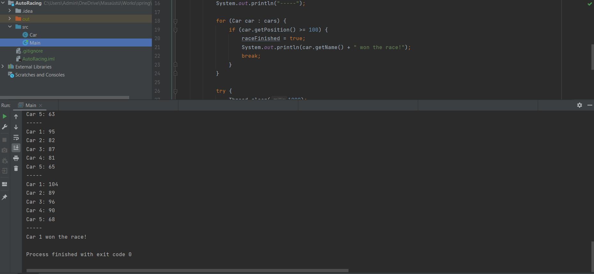

# Car Race Game

[English]

This is a simple car race game simulated in the Java console. The game allows you to simulate a race between multiple cars and determine the winner based on their progress.

### How to Play

1. Clone the repository or download the source code.
2. Open the project in your preferred Java IDE.
3. Run the `CarRaceGame.java` file.
4. Observe the cars' progress as they move forward.
5. The race finishes when any car reaches a position of 100 or more.
6. The winner will be displayed on the console.

[Türkçe]

Bu basit araba yarışı oyunu, Java konsolunda simüle edilir. Oyun, birden fazla araba arasında yarışı simüle etmenizi sağlar ve ilerlemelerine göre birinciyi belirler.

### Nasıl Oynanır

1. Repository klonlayın veya kaynak kodunu indirin.
2. Projeyi tercih ettiğiniz Java IDE'sinde açın.
3. `CarRaceGame.java` dosyasını çalıştırın.
4. Arabaların ilerlemesini takip edin.
5. Herhangi bir araba 100 veya daha fazla bir konuma ulaştığında yarış sonlanır.
6. Kazanan konsol ekranında görüntülenir.

